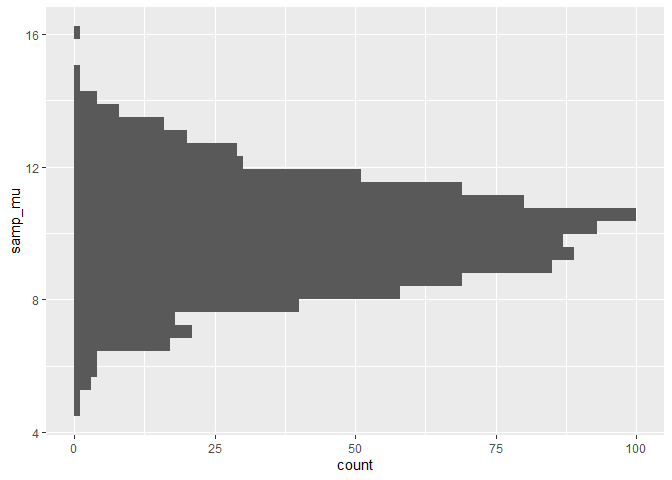
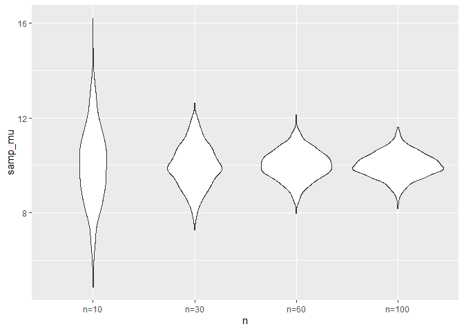
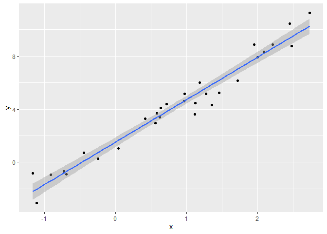
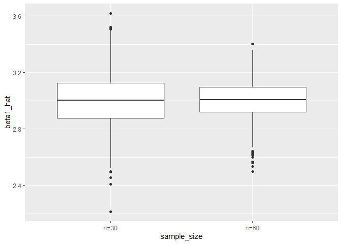
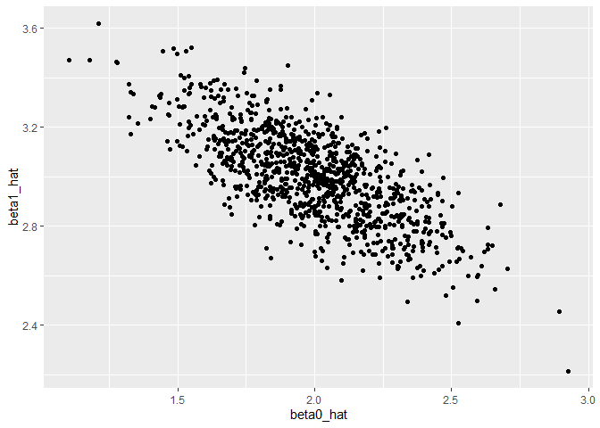
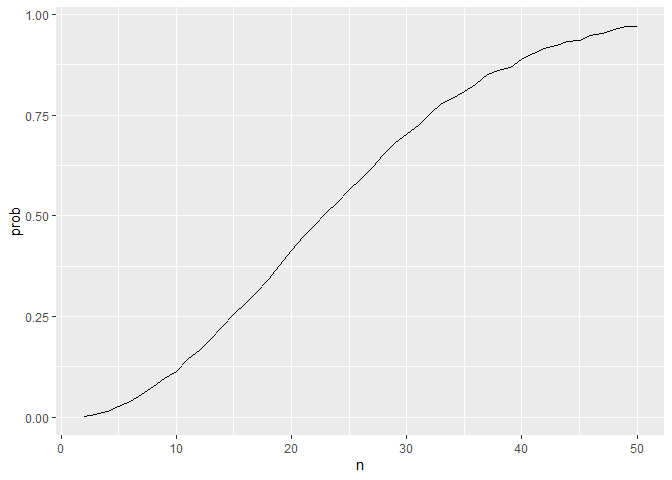

Simulation
================
Tianqi Li
2024-11-03

## writing a simulation function

``` r
sim_data = tibble(
  x = rnorm(30,10,5)
)

sim_data |> 
  summarize(
    mu_hat = mean(x),
    sigma_hat = sd(x)
  )
```

    ## # A tibble: 1 × 2
    ##   mu_hat sigma_hat
    ##    <dbl>     <dbl>
    ## 1   9.66      4.36

``` r
sim_mean_sd = function(n, mu = 10, sigma = 5) {
  
  sim_data = tibble(
    x = rnorm(n, mu, sigma),
  )
  
  out_df = 
    sim_data |> 
    summarize(
      samp_mu = mean(x),
      samp_sigma = sd(x)
    )
  return(out_df)
}
sim_mean_sd(50)
```

    ## # A tibble: 1 × 2
    ##   samp_mu samp_sigma
    ##     <dbl>      <dbl>
    ## 1    10.4       5.84

run this a lot of times…

run this using a for loop?

``` r
output = vector("list", 1000)

for (i in 1:1000) {
  output[[i]] = sim_mean_sd(30)
}

bind_rows(output) |>
  summarise(ave_samp_mean=mean(samp_mu),
            SE_samp_mean = sd(samp_mu))
```

    ## # A tibble: 1 × 2
    ##   ave_samp_mean SE_samp_mean
    ##           <dbl>        <dbl>
    ## 1          10.0        0.957

``` r
# compare sd(mu) with sigma/sqrt(n) 5/sqrt(30)
```

set.seed will makesure everytime you run the simulation you get the same
results.

``` r
set.seed(1)
rnorm(5)
```

    ## [1] -0.6264538  0.1836433 -0.8356286  1.5952808  0.3295078

``` r
rnorm(5)
```

    ## [1] -0.8204684  0.4874291  0.7383247  0.5757814 -0.3053884

``` r
set.seed(1)
rnorm(5)
```

    ## [1] -0.6264538  0.1836433 -0.8356286  1.5952808  0.3295078

Can I use map instead

``` r
sim_res = 
  tibble(
    iter = 1:1000
  ) |>
  mutate(samp_res = map(iter, sim_mean_sd, n = 30)) |>
  unnest(samp_res)
```

Could I try different sample sizes?

``` r
sim_res = 
  expand_grid(
    n = c(10,30,60,100),
    iter = 1:1000
  ) |>
  mutate(samp_res = map(n, sim_mean_sd)) |>
  unnest(samp_res)
```

``` r
sim_res |>
  group_by(n) |>
  summarize(
    se = sd(samp_mu)
  )
```

    ## # A tibble: 4 × 2
    ##       n    se
    ##   <dbl> <dbl>
    ## 1    10 1.63 
    ## 2    30 0.897
    ## 3    60 0.625
    ## 4   100 0.519

``` r
# vs. 5/sqrt(10;30;60;100)
```

``` r
sim_res |>
  filter(n == 10) |>
  ggplot(aes(y = samp_mu)) +
  geom_histogram()
```

    ## `stat_bin()` using `bins = 30`. Pick better value with `binwidth`.

<!-- -->

``` r
sim_res |>
  mutate(
    n = str_c("n=",n), 
    n = fct_inorder(n)) |>
  ggplot(aes(x=n, y = samp_mu)) +
  geom_violin()
```

<!-- -->

## SLR

``` r
sim_data = 
  tibble(
    x = rnorm(30, 1, 1),
    y = 2+3*x +rnorm(30,0,1)
  )
lim_fit = lm(y~x, data = sim_data)

sim_data |>
  ggplot(aes(x = x, y = y)) +
  geom_point() +
  stat_smooth(method = "lm")
```

    ## `geom_smooth()` using formula = 'y ~ x'

<!-- -->

Turn this into a function

``` r
sim_regression = function(n) {
  
  sim_data = 
    tibble(
      x = rnorm(n, 1, 1),
      y = 2+3*x +rnorm(n,0,1)
    )
  
  lm_fit = lm(y~x, data = sim_data)
  
  out_df = 
    tibble(
      beta0_hat = coef(lm_fit)[1],
      beta1_hat = coef(lm_fit)[2]
    )
    
  return(out_df)

}

sim_res = 
  expand_grid(
    sample_size = c(30,60),
    iter = 1:1000
  ) |>
  mutate(lm_res = map(sample_size, sim_regression)) |>
  unnest(lm_res)

sim_res |>
  mutate(
    sample_size = str_c("n=",sample_size)) |>
  ggplot(aes(x = sample_size, y = beta1_hat)) +
  geom_boxplot()
```

<!-- --> narrower
box with higher n (better)

``` r
sim_res |>
  filter(sample_size == 30) |>
  ggplot(aes(x = beta0_hat, y = beta1_hat )) +
  geom_point()
```

<!-- -->

## Birthday problem!!

Let’s put people in a room

``` r
bday_sim = function(n) {

  bdays = sample(1:365, size = n, replace = TRUE)
  
  duplicate = length(unique(bdays)) < n
  
  return(duplicate)
}

bday_sim(10)
```

    ## [1] FALSE

``` r
bday_sim(50)
```

    ## [1] TRUE

run this a lot

``` r
sim_res = 
  expand_grid(
    n = c(2:50),
    iter = 1:10000
  ) |>
  mutate(res = map_lgl(n,bday_sim)) |>
  group_by(n) |>
  summarize(prob = mean(res))

sim_res |>
  ggplot(aes(x = n, y = prob)) +
  geom_line()
```

<!-- -->
